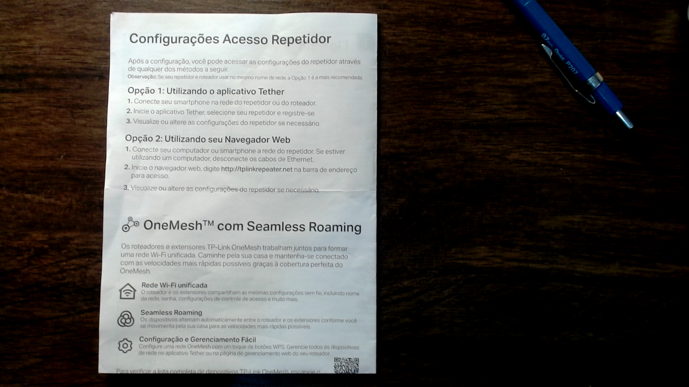
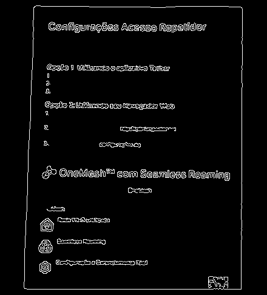

# Document Scanner

A Python/OpenCV program simulating a B&W document scanner.

## Installation
Create a conda environment using requirements.txt
```bash
conda create --name <env> --file requirements.txt
```

## Summary
The program executes three main steps:

1. Document Edge Detection using the Canny algorithm
2. Find Contours of the Edged Image
3. Apply perspective transform

The program applies a four point perspective transformation
imitating a B&W scanner

The modules folder contains the functions for performing
the four point perspective transform. Credits to [PyImageSearch](https://pyimagesearch.com).

## Usage

#### Webcam
```bash
python doc_scan.py -w True
```
Images captured by the webcam are saved in the [Images](./images) folder

#### Input image
```bash
python doc_scan.py -i <path_to_image>
```

## Hints
For best results, make sure the image has good light conditions and
reasonable contrast between background and foreground

## Example
#### Original


#### Edge Detection


#### Outlined


#### Scanned


