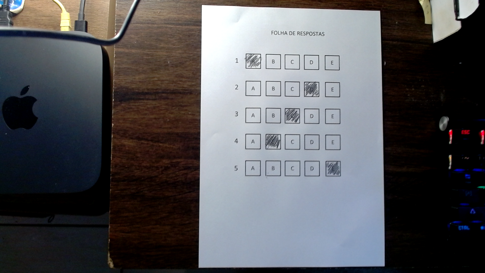
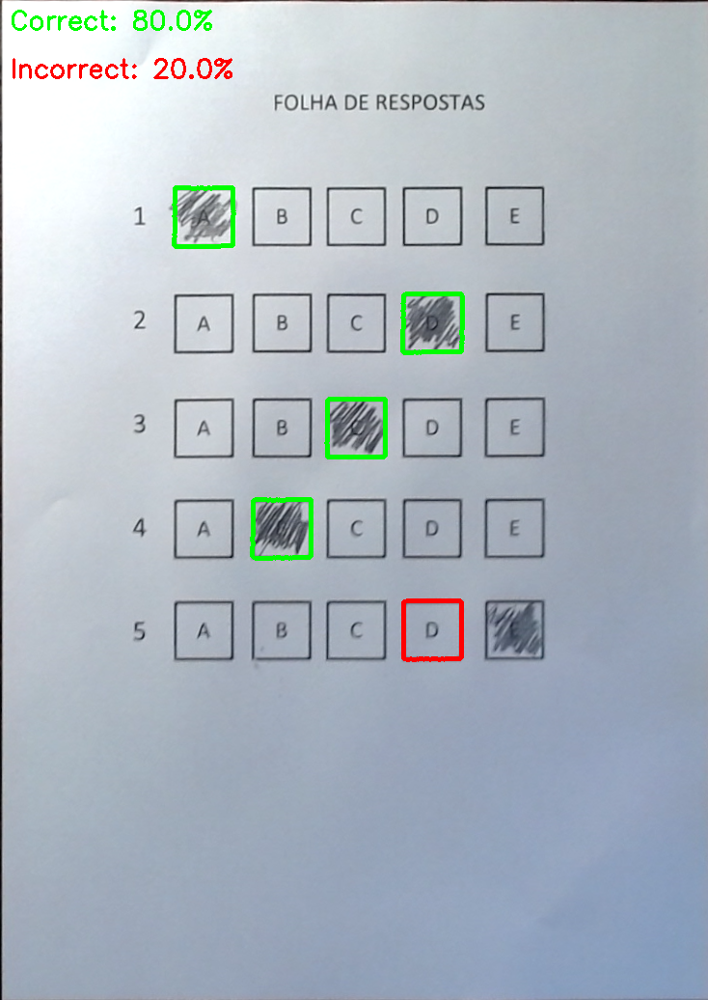

# Answer Sheet Grader

A Python/OpenCV program simulating an answer sheet grader.

## Installation
Create a conda environment using requirements.txt
```bash
conda create --name <env> --file requirements.txt
```

## Summary
The program executes five main steps:

1. Document Edge Detection using the Canny algorithm
2. Find Contours of the Edged Image
3. Apply perspective transform
4. Extract answer bubbles/squares contours
5. Grading


The modules folder contains the functions for performing
the four point perspective transform. Credits to [PyImageSearch](https://pyimagesearch.com).

## Usage

#### Webcam
```bash
python grader.py -w True 
```
Images captured by the webcam are saved in the [images](./images) folder \
Graded images are saved in the [scanned_images](./scanned_images) folder

#### Input image
```bash
python grader.py -i <path_to_image> 
```

## Hints
For best results, make sure the image has good light conditions and
reasonable contrast between background and foreground


## Example
#### Original


#### Graded


