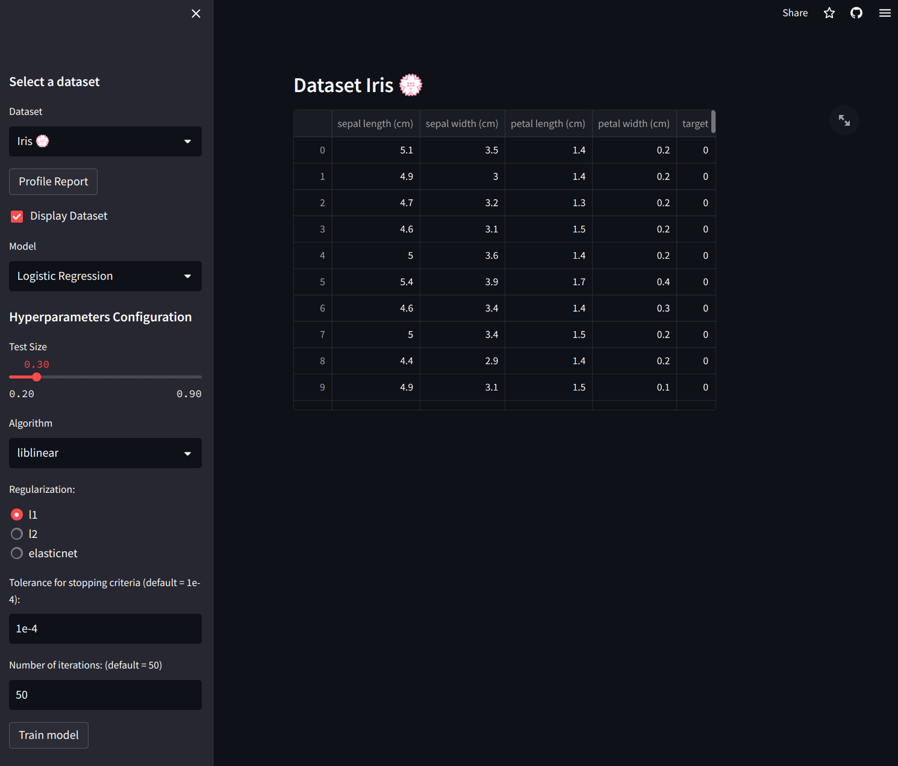
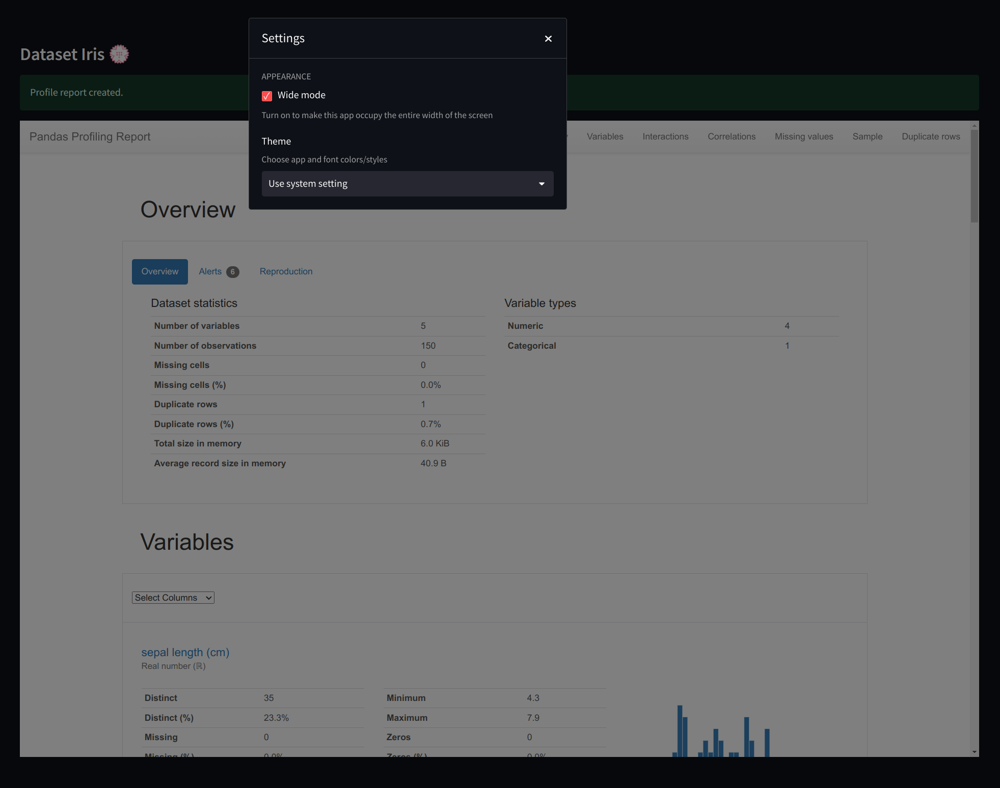
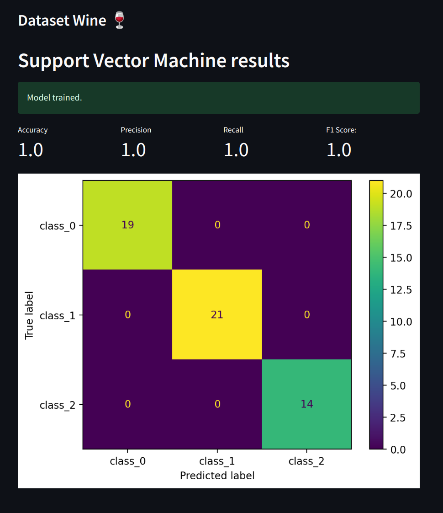

# Streamlit ML Classification

A Streamlit App to help ML learners to observe how changing hyperparaters affects an ML classification model results

[Live version 🌎️](https://cpoles-data-science-projectsstreamlit-classificationapp-v7dll7.streamlit.app/)

## **Home Page**
### Hyperparameters can be tuned on the left side bar. Dataset can be displayed by selecting *'Display Dataset'*

#
## **Profile Report**
### Easily generates an exploratory report of the data for EDA. Also works in *Wide Mode*

#
## **Sample Results**
### Confusion Matrix and Classification Metrics

